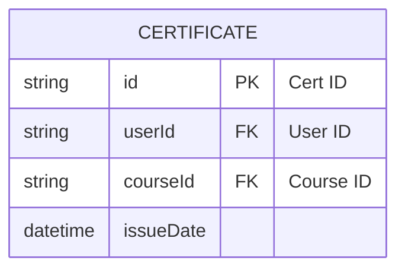

# CERTIFICATES CERVICE

### Data structure



### Command to compile protocol buffer 

```
$ protoc --go_out=. --go-grpc_out=. ./api/proto/certificates.proto
```

### Build and run

```
docker build . -t gu-certmgr
docker run --rm -p 8080:8888 gu-certmgr
```
